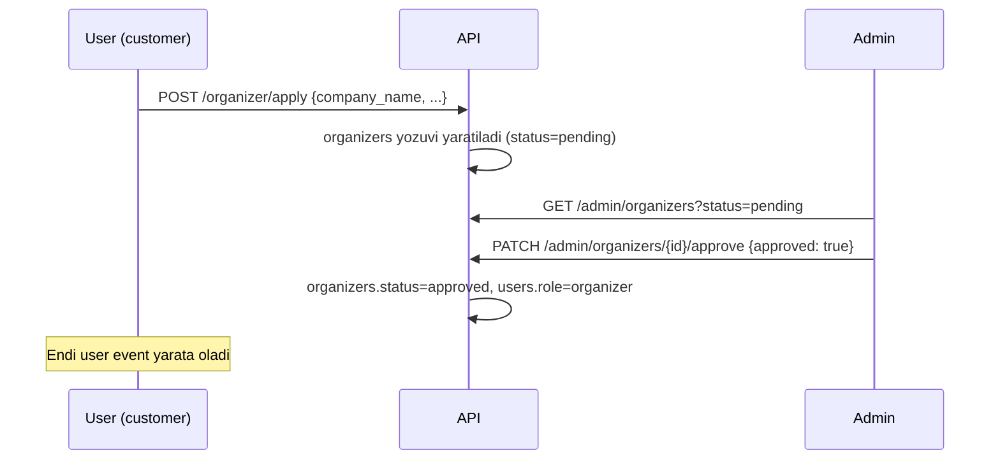

# 05 — Rollar va ruxsatlar (RBAC)

> MVP uchun RBAC ataylab **juda sodda** qilib olingan — murakkab permission-matrix jadval yoki tashqi RBAC kutubxonasi kerak emas. Bor-yo'g'i 3 ta rol va 2 ta oddiy FastAPI dependency yetarli.

## 1. Rollar

| Rol | Kim | Nima qila oladi |
|---|---|---|
| `customer` | Har qanday ro'yxatdan o'tgan foydalanuvchi (default) | Event ko'rish, ticket sotib olish, o'z buyurtmalarini ko'rish |
| `organizer` | Admin tomonidan tasdiqlangan `customer` | + o'z eventlarini yaratish/boshqarish, o'z eventiga check-in qilish |
| `admin` | Platforma xodimi | + organizer arizalarini tasdiqlash, barcha eventlarni moderatsiya qilish, istalgan eventga check-in qilish, umumiy statistika |

Rol `users.role` ustunida saqlanadi (enum: `customer | organizer | admin`). **Alohida `checkin_staff` roli yo'q** — check-in faqat o'z eventining egasi bo'lgan `organizer` yoki har qanday `admin` tomonidan bajariladi. Agar kelajakda tashkilotchi o'z jamoasiga alohida skaner huquqi berish kerak bo'lsa, bu keyingi fazada alohida `event_staff` jadvali sifatida qo'shiladi — MVP uchun ortiqcha.

## 2. Ruxsatlar — qisqacha jadval

| Amal | customer | organizer (o'ziniki) | admin |
|---|:---:|:---:|:---:|
| Eventlarni ko'rish (published) | ✅ | ✅ | ✅ |
| Ticket sotib olish | ✅ | ✅ | ✅ |
| Event yaratish/tahrirlash | ❌ | ✅ (faqat o'zinikini) | ✅ (barchasi) |
| Ticket turi qo'shish/tahrirlash | ❌ | ✅ (faqat o'zinikini) | ✅ |
| Check-in skan qilish | ❌ | ✅ (faqat o'z eventiga) | ✅ (barcha eventga) |
| Organizer arizasini tasdiqlash | ❌ | ❌ | ✅ |
| Foydalanuvchi/event moderatsiyasi 🎓 | ❌ | ❌ | ✅ (bonus, MVP'da yo'q) |

Bu jadval kodda alohida permission-engine sifatida emas, balki har bir endpointda oddiy shart tekshiruvi (`if event.organizer_id != current_user.organizer_id: raise 403`) orqali amalga oshiriladi.

## 3. JWT tuzilishi

```json
{
  "sub": "user_id (uuid)",
  "role": "customer | organizer | admin",
  "exp": 1234567890
}
```

- **Access token**: qisqa muddatli (masalan 15-30 daqiqa).
- **Refresh token**: uzoq muddatli (masalan 7-30 kun), alohida (odatda `httpOnly` cookie yoki DB'da saqlangan) — access token muddati tugaganda yangilash uchun ishlatiladi.
- `organizer_id` claim'ga qo'shilmaydi — kerak bo'lganda `organizers` jadvalidan `user_id` orqali olinadi (JWT'ni yengil saqlash uchun).

## 4. FastAPI dependency patternlari

Ikkita oddiy dependency yetarli:

```python
# get_current_user — tokenni dekodlaydi, users jadvalidan foydalanuvchini oladi
async def get_current_user(
    token: str = Depends(oauth2_scheme),
    session: AsyncSession = Depends(get_db_session),
) -> User: ...


# require_roles — faqat berilgan rollarga ruxsat beradi
def require_roles(*allowed_roles: str):
    async def checker(user: User = Depends(get_current_user)) -> User:
        if user.role not in allowed_roles:
            raise HTTPException(403, "Ruxsat yo'q")
        return user

    return checker
```

Ishlatilishi:

```python
@router.post("/organizer/events")
async def create_event(
    data: EventCreateSchema,
    user: User = Depends(require_roles("organizer")),
): ...
```

**Ownership check** (organizer faqat o'z resursiga kira olishi) alohida dependency yoki service qatlamida oddiy `if` bilan tekshiriladi — masalan `EventService.get_owned_or_403(event_id, user)`.

## 5. Organizer tasdiqlash oqimi



> Bu — MVP'dagi admin panelning **yagona** vazifasi. Event moderatsiyasi va foydalanuvchi boshqaruvi 🎓 bonus sifatida keyingi bosqichda qo'shiladi ([[01-prd.md]]).

## Bog'liq hujjatlar

[[01-prd.md]] · [[04-api-specification.md]] · [[10-non-functional-requirements.md]]
